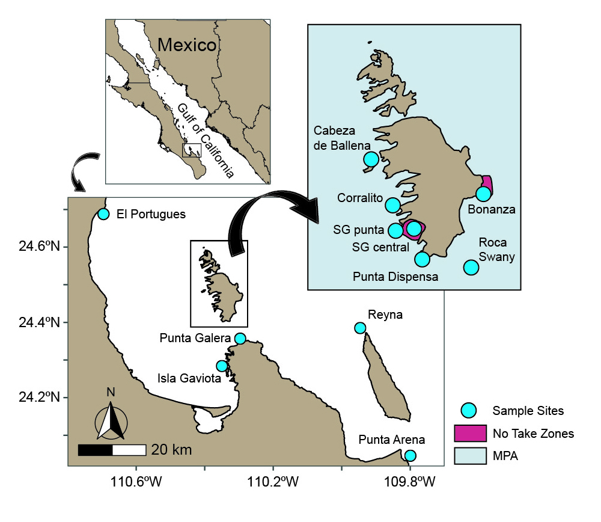

# Isolation by disturbance (ID): a pattern of genetic structure of the coral *Pocillopora grandis* in the Gulf of California

## Information repository for Manuscript:

Dennis LE, Favoretto F, Balart EF, Munguia-Vega A, Sánchez-Ortiz A, Paz-García DA (2024). Isolation by disturbance: a pattern of genetic structure of the coral *Pocillopora grandis* in the Gulf of California. *Marine Ecology Progress Series* (https://doi.org/10.3354/meps14553).

A publication of [Marine BioGenomics](https://en.marinebiogenomics.com/)

## General information about the Research

### Study Area (Gulf of California)

The study area includes the Espíritu Santo Archipelago National Marine Park and five surrounding sites outside of the protected area within the southern Gulf of California, Mexico.

This MPA has three levels of protection: 1) no-take zones where anchoring of boats and fishing is prohibited; 2) buffer zones of “traditional use”; and 3) buffer zones of “sustainable use” (CONANP 2014).

### Genetic Diversity

 A total of 12 and 14 haplotypes were identified from *Pocillopora* and *P. panamensis* corals, respectively.

#### GenBank accession numbers
* *Pocillopora* HSP70B (OP271742-OP271753)
* *Porites* ND1 (OP554198-OP554211)

## R scripts

* [Cluster analysis (Poci_clusterR script)](Scripts/Poci_clusterRscript.R)
* [Plot Haplotype and nucleotide diversities by site (HDplotscriptfj.R)](Scripts/HDplotscriptfj.R)
* [Plotting the PCU stackbar (PCU_stackbarRscriptGH.R)](Scripts/PCU_stackbarRscriptGH.R)
* [Plot mean Rao over time (raotrendcleanscript.R)](Scripts/raotrendcleanscript.R)
* [Principal component analysis of PCU data by site (pcupcaRscript)](Scripts/PCUPCARscript.R)
* [Bray Curtis calculations of PCu data and then mantel test with Bray Curtis values against genetic distances (Phipt)(PCU_Braycurtis_stackbarRscript.R)](Scripts/PCU_Braycurtis_stackbarRscript.R)
