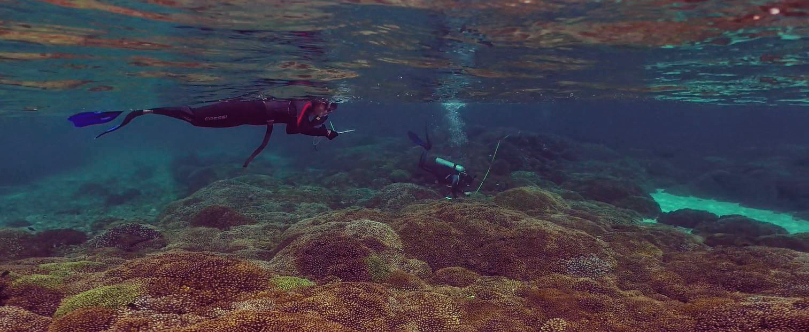

# Isolation by environment and distance: Contrasting patterns of genetic diversity in two scleractinian corals in the Gulf of California

## Information repository for Manuscript:

Dennis LE, Favoretto F, Balart EF, Hellberg ME, Munguia-Vega A, Sánchez-Ortiz A, Paz-García DA (In Review). [Isolation by environment and distance: contrasting patterns of genetic diversity in two scleractinian corals in the Gulf of California](https://www.marinebiogenomics.com/publicaciones). *Frontiers in Marine Science* https://doi.org/

## General information about the Research

### Study Area (Gulf of California)

The study area includes the Espíritu Santo Archipelago National Marine Park and five surrounding sites outside of the protected area within the southern Gulf of California, Mexico.

This MPA has three levels of protection: 1) no-take zones where anchoring of boats and fishing is prohibited; 2) buffer zones of “traditional use”; and 3) buffer zones of “sustainable use” (CONANP 2014).

### Genetic Diversity

 A total of 12 and 14 haplotypes were identified from *Pocillopora* and *P. panamensis* corals, respectively.

#### GenBank accession numbers
* *Pocillopora* HSP70B (OP271742-OP271753)
* *Porites* ND1 (OP554198-OP554211)

## R scripts

* [HDplotscriptfj.R](Scripts/HDplotscriptfj.R)
* [PCU_Braycurtis_stackbarRscript.R](Scripts/PCU_Braycurtis_stackbarRscript.R)
* [PCUPCARscript.R](Scripts/PCUPCARscript.R)
* [Poci_clusterRscript.R](Scripts/Poci_clusterRscript.R)
* [raotrendcleanscript.R](Scripts/raotrendcleanscript.R)
